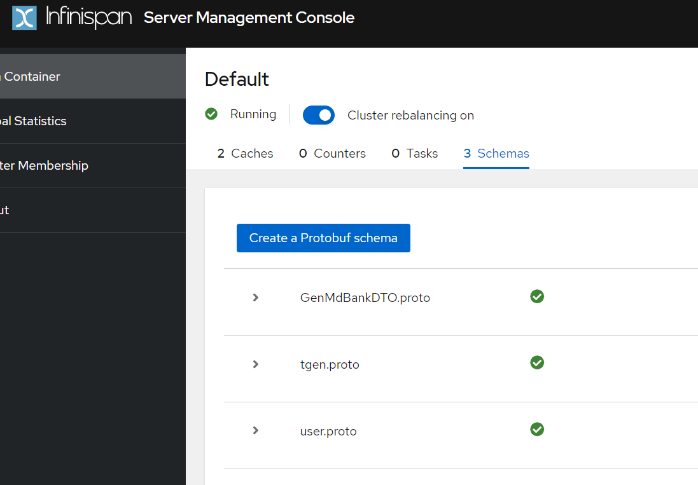
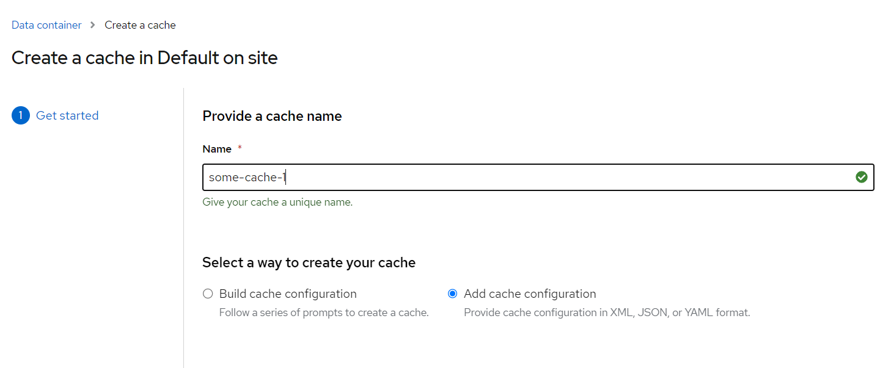

# Spring, Infinispan, and MySql Integration

This is a simple implementation for Infinispan and Database (MySql and Oracle) integration, where we are using Database as persistent cache store. In this sample, Infinispan will load all data from Database as initial cache, and able to write to database if there is some additional new data added.

```
https://infinispan.org/docs/stable/titles/configuring/configuring.html#configuring-sql-cache-stores-table_persistence
```

## Table Structure
Using a MySql table
```sql
create table t_gen
(
    bank_id           int           not null,
    sub_account_code  varchar(16)   null,
    sub_description   varchar(100)  null,
    fi_bank           char(3)       null,
    priority          int           null,
    bank_code         char(3)       null,
    bank_branch       varchar(100)  null,
    bank_account_no   varchar(30)   null,
    bank_account_name varchar(100)  null,
    currency_code     char(3)       null,
    fi_plafond        bigint        null,
    bank_fee          decimal(9, 6) null,
    contact_person    varchar(100)  null,
    contact_telephone varchar(50)   null,
    email             varchar(100)  null,
    record_status     varchar(1)    null,
    constraint t_gen_bank_id_uindex
        unique (bank_id)
);

alter table t_gen
    add primary key (bank_id);

INSERT INTO db_test.t_gen (bank_id, sub_account_code, sub_description, fi_bank, priority, bank_code, bank_branch, bank_account_no, bank_account_name, currency_code, fi_plafond, bank_fee, contact_person, contact_telephone, email, record_status) VALUES (1, 'SUB_01', 'DESC_01', 'FIB', 3, 'COD', 'BRANCH_01', '0001', 'ACCT_NAME', 'IDR', 1000000, 100.766510, 'CP', '08111111', 'email@email.com', 'Y');

INSERT INTO db_test.t_gen (bank_id, sub_account_code, sub_description, fi_bank, priority, bank_code, bank_branch, bank_account_no, bank_account_name, currency_code, fi_plafond, bank_fee, contact_person, contact_telephone, email, record_status) VALUES (2, 'SUB_02', 'DESC_02', 'FIC', 2, 'DOL', 'BRANCH_02', '0002', 'ACCT_002', 'USD', 2000, 15.244310, 'LE', '021524311', 'some@random.com', 'N');
```

Using a Oracle table
```sql

CREATE TABLE "GEN_MD_02"
(	"BANK_ID" NUMBER(10,0) NOT NULL ENABLE,
     "SUB_ACCOUNT_CODE" VARCHAR2(16 CHAR) NOT NULL ENABLE,
     "SUB_DESCRIPTION" VARCHAR2(100 CHAR) NOT NULL ENABLE,
     "FI_BANK" CHAR(3 CHAR) NOT NULL ENABLE,
	"PRIORITY" NUMBER(3,0) NOT NULL ENABLE,
	"BANK_CODE" CHAR(3 CHAR) NOT NULL ENABLE,
	"BANK_BRANCH" VARCHAR2(100 CHAR) NOT NULL ENABLE,
	"BANK_ACCT_NO" VARCHAR2(30 CHAR) NOT NULL ENABLE,
	"BANK_ACCT_NAME" VARCHAR2(100 CHAR) NOT NULL ENABLE,
	"CURRENCY_CODE" CHAR(3 CHAR) NOT NULL ENABLE,
	"FI_PLAFOND" NUMBER(16,2),
	"BANK_FEE" NUMBER(9,6),
	"CONTACT_PERSON" VARCHAR2(100 CHAR),
	"CONTACT_TELEPHONE" VARCHAR2(50 CHAR),
	"EMAIL" VARCHAR2(100 CHAR),
	"RECORD_STATUS" VARCHAR2(1 CHAR) NOT NULL ENABLE,
	 CONSTRAINT "GEN_MD_BANK_PK" PRIMARY KEY ("BANK_ID")
      USING INDEX PCTFREE 10 INITRANS 2 MAXTRANS 255 COMPUTE STATISTICS
      STORAGE(INITIAL 65536 NEXT 1048576 MINEXTENTS 1 MAXEXTENTS 2147483645
      PCTINCREASE 0 FREELISTS 1 FREELIST GROUPS 1
      BUFFER_POOL DEFAULT FLASH_CACHE DEFAULT CELL_FLASH_CACHE DEFAULT)
      TABLESPACE "TBS"  ENABLE
   );

INSERT INTO SYSTEM.GEN_MD_02 (BANK_ID, SUB_ACCOUNT_CODE, SUB_DESCRIPTION, FI_BANK, PRIORITY, BANK_CODE, BANK_BRANCH, BANK_ACCT_NO, BANK_ACCT_NAME, CURRENCY_CODE, FI_PLAFOND, BANK_FEE, CONTACT_PERSON, CONTACT_TELEPHONE, EMAIL, RECORD_STATUS) VALUES (1, 'SUB_01', 'DESC_01', 'FIB', 1, 'BNK', 'BRANCH_01', '00001', 'ACCT_NAME', 'IDR', 100000000000.00, 16.615142, 'CP01', '021817261', 'edwin@redhat.com', 'Y');
INSERT INTO SYSTEM.GEN_MD_02 (BANK_ID, SUB_ACCOUNT_CODE, SUB_DESCRIPTION, FI_BANK, PRIORITY, BANK_CODE, BANK_BRANCH, BANK_ACCT_NO, BANK_ACCT_NAME, CURRENCY_CODE, FI_PLAFOND, BANK_FEE, CONTACT_PERSON, CONTACT_TELEPHONE, EMAIL, RECORD_STATUS) VALUES (2, 'SUB_02', 'DESC_02', 'FOB', 2, 'ODD', 'BRANCH_02', '00021', 'ACCTN_NM2', 'USD', 150000000000.00, 522.162510, 'PC_02', '0217262615', 'some@ewmail.com', 'Y');
    
```

## Infinispan Image
We are using a custom Infinispan with a mysql jdbc driver, 
```
$ docker build -t custom-infinispan-with-mysql .
```

or use a oracle driver if we are going to connect to an existing Oracle instance.

## Build Jar File
```
$ mvn clean package -s settings.xml
```

## Create Proto Schema in Infinispan
We can import `GenMdBankDTO.proto` schema into Infinispan server by copying the content of `GenMdBankDTO.proto` into Infinispan's `Add Protobuf schema` 


## Create Database connection
To create `some-cache` in Infinispan, we can use `create cache` menu and select `add cache configuration`, and copy the content of `some-cache.json` there. 


## How to Test using MySql
Get some data from `some-cache`
```
$ time curl -kv "http://localhost:8080/get-some-cache"

*   Trying ::1:8080...
* TCP_NODELAY set
* Connected to localhost (::1) port 8080 (#0)
> GET /get-some-cache HTTP/1.1
> Host: localhost:8080
> User-Agent: curl/7.65.0
> Accept: */*
>
* Mark bundle as not supporting multiuse
< HTTP/1.1 200
< Content-Type: application/json
< Transfer-Encoding: chunked
< Date: Thu, 05 Oct 2023 07:51:52 GMT
<
* Connection #0 to host localhost left intact
{"1":{"bank_id":"1","sub_account_code":"SUB_01","sub_description":"DESC_01","fi_bank":"FIB","priority":3,"bank_code":"COD","bank_branch":"BRANCH_01","bank_account_no":"0001","bank_account_name":"ACCT_NAME","currency_code":"IDR","fi_plafond":"1000000","bank_fee":100.76651,"contact_person":"CP","contact_telephone":"08111111","email":"email@email.com","record_status":"Y"},"2":{"bank_id":"2","sub_account_code":"SUB_02","sub_description":"DESC_02","fi_bank":"FIC","priority":2,"bank_code":"DOL","bank_branch":"BRANCH_02","bank_account_no":"0002","bank_account_name":"ACCT_002","currency_code":"USD","fi_plafond":"2000","bank_fee":15.24431,"contact_person":"LE","contact_telephone":"021524311","email":"some@random.com","record_status":"N"}}

real 0m 0.13s
user    0m 0.04s
sys     0m 0.03s
```

Add some data
```
$ time curl -kv "http://localhost:8080/add-some-cache?bank_id=3&sub_account_code=SUB_03&sub_description=desc_03&fi_bank=III&priority=2&bank_code=BCA&bank_branch=BRANCH_03&bank_account_no=9181&bank_account_name=ACCT_03&currency_code=GBR&fi_plafond=5000&bank_fee=817.251514&contact_person=CP01&contact_telephone=8171625&email=edwin@redhat.com&record_status=1"
*   Trying ::1:8080...
* TCP_NODELAY set
* Connected to localhost (::1) port 8080 (#0)
> GET /add-some-cache?bank_id=3&sub_account_code=SUB_03&sub_description=desc_03&fi_bank=III&priority=2&bank_code=BCA&bank_branch=BRANCH_03&bank_account_no=9181&bank_account_name=ACCT_03&currency_code=GBR&fi_plafond=5000&bank_fee=817.251514&contact_person=CP01&contact_telephone=8171625&email=edwin@redhat.com&record_status=1 HTTP/1.1
> Host: localhost:8080
> User-Agent: curl/7.65.0
> Accept: */*
>
* Mark bundle as not supporting multiuse
< HTTP/1.1 200
< Content-Type: application/json
< Transfer-Encoding: chunked
< Date: Thu, 05 Oct 2023 07:51:00 GMT
<
* Connection #0 to host localhost left intact
{"bank_id":"3","sub_account_code":"SUB_03","sub_description":"desc_03","fi_bank":"III","priority":2,"bank_code":"BCA","bank_branch":"BRANCH_03","bank_account_no":"9181","bank_account_name":"ACCT_03","currency_code":"GBR","fi_plafond":"5000","bank_fee":817.251514,"contact_person":"CP01","contact_telephone":"8171625","email":"edwin@redhat.com","record_status":"1"}

real    0m 0.31s
user    0m 0.03s
sys     0m 0.06s
```

## How to Test using Oracle
```
 time curl -kv "http://localhost:8080/get-some-cache"
*   Trying ::1:8080...
* TCP_NODELAY set
* Connected to localhost (::1) port 8080 (#0)
> GET /get-some-cache HTTP/1.1
> Host: localhost:8080
> User-Agent: curl/7.65.0
> Accept: */*
>
* Mark bundle as not supporting multiuse
< HTTP/1.1 200
< Content-Type: application/json
< Transfer-Encoding: chunked
< Date: Mon, 09 Oct 2023 10:26:14 GMT
<
* Connection #0 to host localhost left intact
{"1":{"bank_id":"1","sub_account_code":"SUB_01","sub_description":"DESC_01","fi_bank":"FIB","priority":1,"bank_code":"BNK","bank_branch":"BRANCH_01","bank_acct_no":"00001","bank_acct_name":"ACCT_NAME","currency_code":"IDR","fi_plafond":1.0E11,"bank_fee":16.615142,"contact_person":"CP01","contact_telephone":"021817261","email":"edwin@redhat.com","record_status":"Y"},"2":{"bank_id":"2","sub_account_code":"SUB_02","sub_description":"DESC_02","fi_bank":"FOB","priority":2,"bank_code":"ODD","bank_branch":"BRANCH_02","bank_acct_no":"00021","bank_acct_name":"ACCTN_NM2","currency_code":"USD","fi_plafond":1.5E11,"bank_fee":522.16251,"contact_person":"PC_02","contact_telephone":"0217262615","email":"some@ewmail.com","record_status":"Y"}}

real    0m 0.14s
user    0m 0.04s
sys     0m 0.09s


```